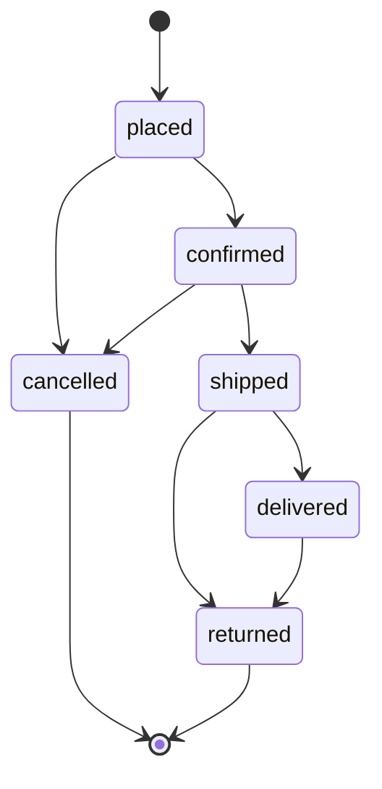

# Single Vendor Ecommerce Admin Panel - Technical Blueprint & API Specification

A production-oriented technical documentation for building and operating the **Single Vendor Ecommerce Admin Panel** built on top of our existing 4 **Node.js Microservices** (`auth-service`, `catalog-service`, `cart-service`, `order-service`) and **API Gateway**.

---

## 1. Stack & System Architecture

### Frontend (Client)
- React / Expo React Native
- Redux Toolkit & RTK Query
- Context API (UI & Local state)

### Backend Microservices Layer (Node.js 20 / Express)
- **API Gateway** (`Port 5000`): Entry threshold, sanitizes identity headers, verifies JWT, injects trusted claims (`x-user-id`, `x-user-role`, `x-user-permissions`) downstream.
- **Auth Service** (`Port 5001`): User authentication, profile management, RBAC role assignment, account status toggles, and Audit Log recording.
- **Catalog Service** (`Port 5002`): Product CRUD, Category CRUD, Stock inventory management, and Review moderation.
- **Cart Service** (`Port 5003`): Cart sessions and Promo Coupon CRUD management.
- **Order Service** (`Port 5004`): State-machine-driven Order fulfillment, status transitions, and Dashboard Analytics.

---

## 🔑 Default Admin Sign-In Credentials

When the backend microservices start, `auth-service` automatically seeds a default **Super Admin** account in MongoDB:

| Field | Default Value |
| :--- | :--- |
| **Admin Web Portal URL** | `http://localhost:3000` |
| **Email** | `admin@fashionstore.com` |
| **Password** | `Admin@123` |
| **Role** | `super_admin` |
| **Permissions** | `["*"]` (Full Access) |

---

## 🛡️ 2. Security & Gateway Identity Trust Boundaries

### ⚠️ Anti-Spoofing & Header Sanitization
Client HTTP requests are not trusted to supply identity headers directly. To prevent role spoofing:
1. The **API Gateway** intercepts every incoming request and strips any client-supplied `x-user-id`, `x-user-role`, or `x-user-permissions` headers.
2. The Gateway verifies the bearer JWT token cryptographically using `JWT_SECRET`.
3. The Gateway injects verified claims into downstream headers:
   - `x-user-id`: Verified MongoDB user ObjectId.
   - `x-user-role`: Verified user role (`user`, `admin`, `super_admin`, etc.).
   - `x-user-permissions`: JSON stringified array of granted capability permissions.

---

## 🔐 3. Least-Privilege RBAC & Permission Scopes

Access control across microservices is evaluated using both **Role** level checks (`requireAdmin`) and **Granular Capability** claims (`requirePermission`).

### Role Matrix

| Role | Scope & Description |
|---|---|
| `super_admin` | Full operational control, user role updates, account suspensions, audit log access |
| `admin` | General administrative access across products, categories, coupons, and orders |
| `product_manager` | Managing product listings, categories, inventory, and reviews |
| `order_manager` | Processing orders, advancing order status through state machine, tracking |
| `inventory_manager` | Stock level updates and low-stock monitoring |
| `marketing_admin` | Managing promotional coupon codes and discounts |
| `support` | Customer support ticket handling and order status viewing |
| `user` | Standard customer shopping features |

### Permission Keys Catalog
- `users.view`: View customer profiles and lists.
- `users.manage`: Promote or demote user roles.
- `users.block`: Suspend or block customer accounts.
- `products.view`: View products in admin portal.
- `products.edit`: Create, update, or soft-delete products.
- `categories.edit`: Create, edit, or delete categories.
- `orders.view`: Access platform-wide order listings.
- `orders.status.update`: Advance order status state transitions.
- `dashboard.view`: View aggregated revenue and fulfillment analytics.
- `settings.edit`: Manage promo coupons and platform configurations.
- `audit.view`: Access immutable audit logs.

---

## 🔄 4. Order Lifecycle State Machine

Order status transitions are strictly enforced via `orderStateMachine.js` to prevent invalid or out-of-sequence status changes.

### Transition Matrix



| Current Status | Allowed Target Statuses | Illegal Attempts (Rejected with 400 Bad Request) |
|---|---|---|
| `placed` | `confirmed`, `cancelled` | `shipped`, `delivered`, `returned` |
| `confirmed` | `shipped`, `cancelled` | `placed`, `delivered`, `returned` |
| `shipped` | `delivered`, `returned` | `placed`, `confirmed`, `cancelled` |
| `delivered` | `returned` | `placed`, `confirmed`, `shipped`, `cancelled` |
| `cancelled` | *None (Terminal)* | Any status update |
| `returned` | *None (Terminal)* | Any status update |

---

## 📝 5. Audit Logging for High-Risk Actions

All high-risk administrative mutations automatically produce an immutable audit log entry in the `AuditLog` collection:
- User role updates (`UPDATE_USER_ROLE`)
- User account suspension (`TOGGLE_USER_STATUS`)
- Product deletion / deactivation (`DELETE_PRODUCT`)
- Coupon creation & modification (`CREATE_COUPON`, `DELETE_COUPON`)
- Order status state transitions (`UPDATE_ORDER_STATUS`)

---

## 🔌 6. Comprehensive Microservices Admin API Endpoint Reference

### 1. Auth Service (`Port 5001` via Gateway `/api/v1/auth`)

| Method | Endpoint | Required Permission | Description |
|---|---|---|---|
| `GET` | `/api/v1/auth/admin/users` | `users.view` | List all users (paginated, with search & role/status filters) |
| `GET` | `/api/v1/auth/admin/users/:id` | `users.view` | Get user detailed profile |
| `PATCH` | `/api/v1/auth/admin/users/:id/role` | `users.manage` | Promote/demote user role and assign permission scopes |
| `PATCH` | `/api/v1/auth/admin/users/:id/status` | `users.block` | Block, unblock, or suspend user account |
| `GET` | `/api/v1/auth/admin/audit-logs` | `audit.view` | Retrieve platform administrative audit logs |

---

### 2. Catalog Service (`Port 5002` via Gateway `/api/v1/products`)

| Method | Endpoint | Required Permission | Description |
|---|---|---|---|
| `POST` | `/api/v1/products/admin/products` | `products.edit` | Create a new product with variants, stock, and price |
| `PUT` | `/api/v1/products/admin/products/:id` | `products.edit` | Update product details or stock inventory |
| `DELETE` | `/api/v1/products/admin/products/:id` | `products.edit` | Delete or deactivate product |
| `POST` | `/api/v1/products/admin/categories` | `categories.edit` | Create a new category |
| `PUT` | `/api/v1/products/admin/categories/:id` | `categories.edit` | Update category name/image |
| `DELETE` | `/api/v1/products/admin/categories/:id` | `categories.edit` | Delete category |
| `GET` | `/api/v1/products/admin/reviews` | `products.view` | List all reviews for moderation |
| `DELETE` | `/api/v1/products/admin/reviews/:id` | `products.edit` | Remove inappropriate customer review |

---

### 3. Cart Service (`Port 5003` via Gateway `/api/v1/cart`)

| Method | Endpoint | Required Permission | Description |
|---|---|---|---|
| `GET` | `/api/v1/cart/admin/coupons` | `settings.edit` | List all promo coupon codes |
| `POST` | `/api/v1/cart/admin/coupons` | `settings.edit` | Create new promo coupon code |
| `PUT` | `/api/v1/cart/admin/coupons/:id` | `settings.edit` | Update coupon discount rate or expiry date |
| `DELETE` | `/api/v1/cart/admin/coupons/:id` | `settings.edit` | Delete promo coupon code |

---

### 4. Order Service (`Port 5004` via Gateway `/api/v1/orders`)

| Method | Endpoint | Required Permission | Description |
|---|---|---|---|
| `GET` | `/api/v1/orders/admin/orders` | `orders.view` | Retrieve all platform orders with status filters |
| `PATCH` | `/api/v1/orders/admin/orders/:id/status` | `orders.status.update` | Advance order status using state machine validation |
| `GET` | `/api/v1/orders/admin/dashboard/stats` | `dashboard.view` | Aggregated revenue, total orders, and status metrics |

---

## 🚀 7. Quickstart & Verification Guide

### 1. Promoting a User to Admin
To elevate an initial user to `admin` or `super_admin`:
```json
// PATCH /api/v1/auth/admin/users/<USER_ID>/role
{
  "role": "super_admin",
  "permissions": ["*"]
}
```

### 2. Fetching Analytics Dashboard
```bash
curl -H "Authorization: Bearer <ADMIN_JWT_TOKEN>" http://localhost:5000/api/v1/orders/admin/dashboard/stats
```

### 3. Attempting Invalid State Machine Update
```bash
# Attempting to move delivered order back to placed:
curl -X PATCH http://localhost:5000/api/v1/orders/admin/orders/<ORDER_ID>/status \
  -H "Authorization: Bearer <ADMIN_JWT_TOKEN>" \
  -H "Content-Type: application/json" \
  -d '{"status": "placed"}'

# Response: 400 Bad Request
# {"success": false, "message": "Illegal state transition from 'delivered' to 'placed'."}
```