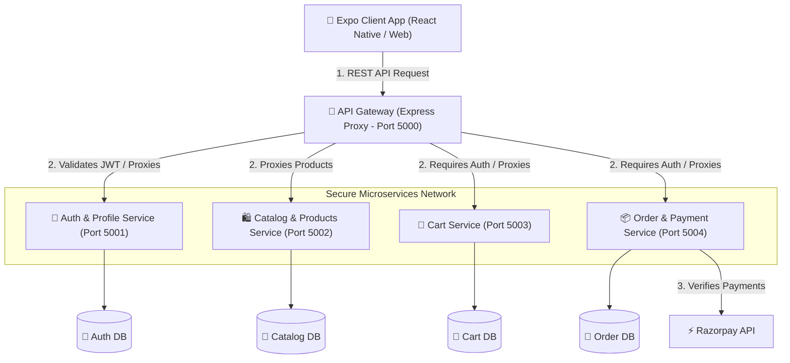

# 🛍️ FashionStoreApp - Microservices E-Commerce Application

FashionStoreApp is a modern, premium, containerized e-commerce platform built using a **Node.js Microservices Backend** and an **Expo (React Native) Mobile/Web Client**. The system uses a centralized API Gateway to handle authentication and route traffic to service-specific MongoDB databases.

---

## 🏗️ Architecture & System Flow

The following diagram illustrates how the frontend mobile app communicates with our backend microservices layer, which is hosted within a private Docker/VPC network:



---

## 🛠️ Technology Stack & Libraries

### 1. Frontend Mobile/Web Client (`/Client`)
Built on top of the **Expo 57** framework (React Native) supporting Android, iOS, and Web.

| Library / Module | Purpose |
| :--- | :--- |
| **Expo SDK 57** | Serverless native compilation framework for cross-platform apps. |
| **React Navigation** | Flexible routing system (Stack, Native Stack, Bottom Tabs). |
| **Redux Toolkit & RTK Query** | Centralized global state management, caching, and database API hooks. |
| **React Native Reanimated (v4)** | Smooth, high-performance UI animations. |
| **React Native Gesture Handler** | Advanced gesture tracking and touch interactions. |
| **React Native Razorpay** | Native payment gateway integration. |
| **Axios** | Lightweight HTTP request client. |
| **React Hook Form** | Efficient form state validation. |
| **Lucide React Native** | Premium vector icon system. |

---

### 2. Backend Microservices (`/Server`)
Built on a modular, decoupled microservices model running on **Node.js 20**.

| Microservice | Port | Database | Primary Libraries Used | Description |
| :--- | :--- | :--- | :--- | :--- |
| **API Gateway** | `5000` | *None* | `express`, `http-proxy-middleware`, `jsonwebtoken`, `cors` | Single point of entry. Intercepts incoming requests, verifies JWT credentials, injects user IDs into headers (`x-user-id`), and proxies requests. |
| **Auth Service** | `5001` | `fashion_auth` | `mongoose`, `bcryptjs`, `nodemailer` | Manages user registration, secure password hashing, profile updates, addresses, wishlist, and OTP mail validation. |
| **Catalog Service** | `5002` | `fashion_catalog` | `mongoose` | Manages product listings, categories, inventory status, and user product reviews. |
| **Cart Service** | `5003` | `fashion_cart` | `mongoose` | Manages persistent user shopping carts, items additions/removals, and coupon validation. |
| **Order Service** | `5004` | `fashion_orders` | `mongoose`, `razorpay` | Handles checkout pipelines, order history state, and secures transactions via Razorpay SDK integrations. |

---

## 🔄 Core Request Flows

### 🔑 1. User Registration & Authentication Flow
```mermaid
sequenceDiagram
    autonumber
    actor Client as 📱 Mobile Client
    participant GW as 🔌 API Gateway (5000)
    participant Auth as 🔐 Auth Service (5001)
    database DB as 🍃 Auth Database
    participant Mail as 📧 SMTP Server (Gmail)

    Client->>GW: POST /api/v1/auth/register (Credentials)
    GW->>Auth: Forward Registration Data
    Auth->>DB: Check if user exists (User Schema)
    Auth->>Mail: Generate & Send 6-digit verification OTP
    Auth->>GW: Return registration initialization state
    GW->>Client: Return verification screen state
    
    Client->>GW: POST /api/v1/auth/verify-otp (OTP Code)
    GW->>Auth: Forward OTP Code
    Auth->>DB: Verify OTP match & activate profile
    Auth->>GW: Return JWT Token & Activated User payload
    GW->>Client: Save JWT in Secure Store / Grant access
```

---

### 💳 2. Order Checkout & Razorpay Payment Flow
```mermaid
sequenceDiagram
    autonumber
    actor Client as 📱 Mobile Client
    participant GW as 🔌 API Gateway (5000)
    participant Order as 📦 Order Service (5004)
    participant RP as ⚡ Razorpay API
    database DB as 🍃 Orders Database

    Client->>GW: POST /api/v1/orders (Items, Address, Payment Method)
    Note over GW: Gateway injects User ID from JWT
    GW->>Order: Proxy order details with headers
    Order->>RP: Initialize transaction (Amount, Currency)
    RP-->>Order: Return Razorpay Order ID (order_prepare_id)
    Order->>DB: Create Order entry in 'placed' state
    Order-->>GW: Return Order details + Razorpay Order ID
    GW-->>Client: Return Order payload
    
    Client->>RP: Launch Razorpay SDK checkout overlay
    Note over Client, RP: User enters UPI/Card pin and completes payment
    RP-->>Client: Return Payment Verification payload (Signature, Payment ID)
    
    Client->>GW: POST /api/v1/orders/verify (IDs & Signature)
    GW->>Order: Forward verification payload
    Order->>Order: Validate Razorpay cryptographic signature locally
    Order->>DB: Update Order status to 'paid' or 'confirmed'
    Order-->>GW: Return success response
    GW-->>Client: Route to OrderSuccess screen & Clear Cart
```

---

## 💻 Local Development Setup

To run the entire ecosystem locally on your development machine, ensure you have **Node.js**, **Docker**, and the **Expo CLI** installed.

### 1. Run the Backend (Using Docker Compose)
1. Navigate to the `Server` directory:
   ```bash
   cd Server
   ```
2. Create environment variables inside `.env` files for each microservice, or fill out the shared `.env` template:
   * Copy the template: `cp .env.example .env`
   * Configure your MongoDB URLs and Razorpay credentials.
3. Build and launch all 5 services simultaneously:
   ```bash
   docker compose up --build
   ```
   *The services are now live on ports `5000` (Gateway) through `5004` (Orders).*

### 2. Run the Frontend Client
1. Navigate to the `Client` directory:
   ```bash
   cd Client
   ```
2. Create a local `.env` configuration file:
   ```env
   EXPO_PUBLIC_API_URL=http://localhost:5000/api/v1
   EXPO_PUBLIC_RAZORPAY_KEY_ID=your_razorpay_key_here
   ```
3. Install dependencies:
   ```bash
   npm install --legacy-peer-deps
   ```
4. Start the Expo bundler:
   ```bash
   npx expo start
   ```

---

## ☁️ Production AWS Deployment

Your backend uses a lightweight **Amazon EC2 + Docker Compose** model. Nginx is configured as a reverse proxy, and Let's Encrypt provides free automatic SSL certificates.

For details, refer to the full deployment documentation:
👉 [aws_deployment_guide.md](file:///C:/Users/uditp/.gemini/antigravity-ide/brain/2196fe70-8872-4ac6-b149-efde45d42058/aws_deployment_guide.md)